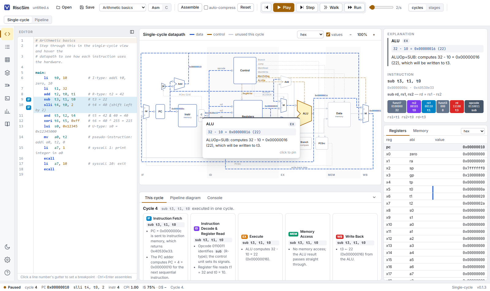
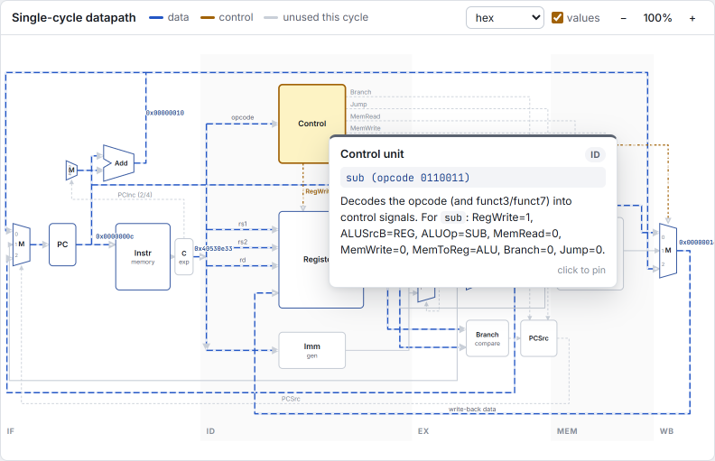
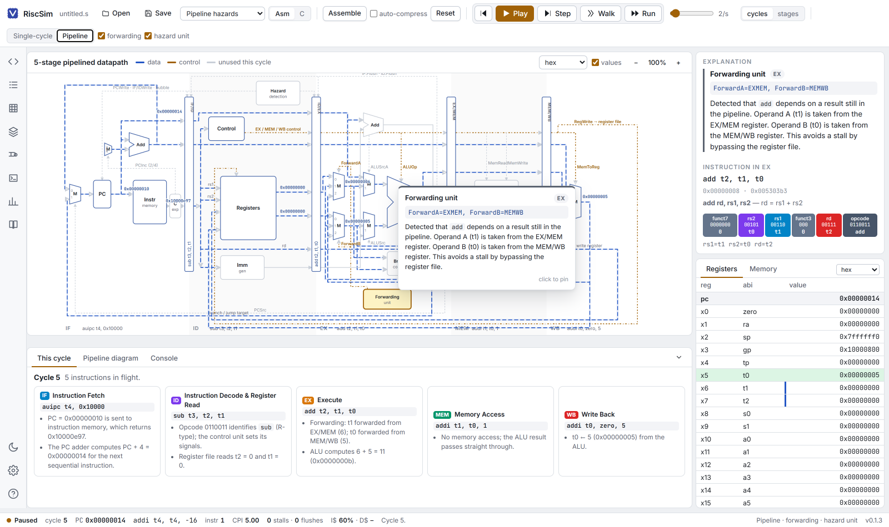
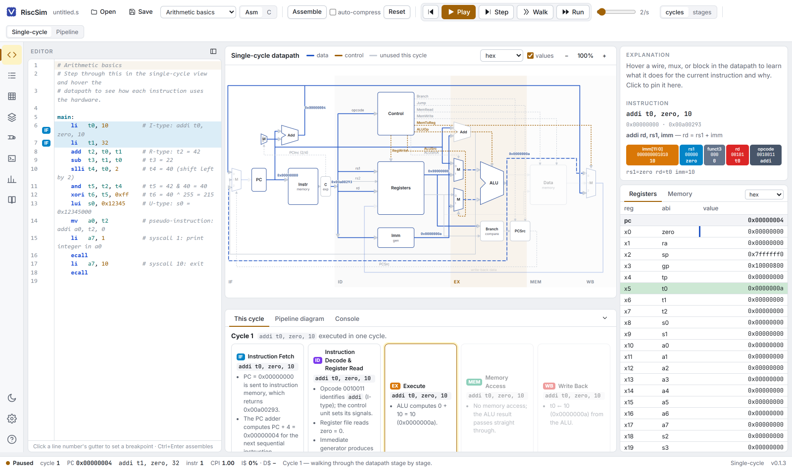
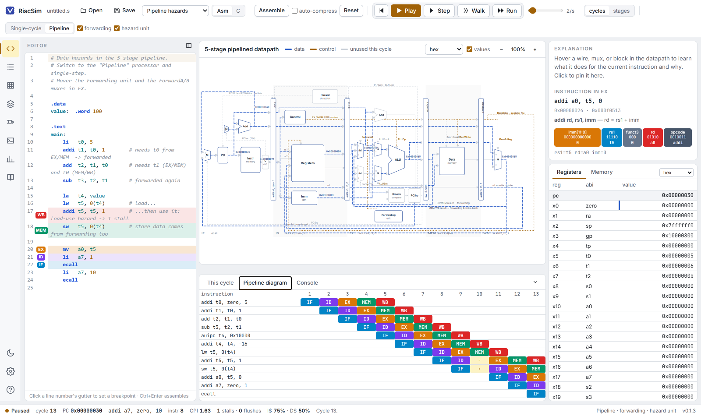
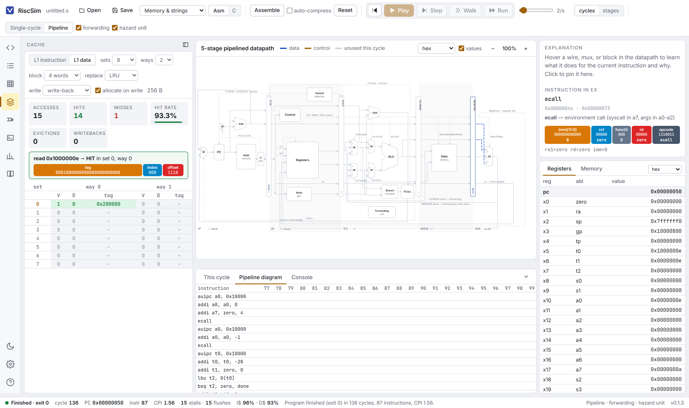
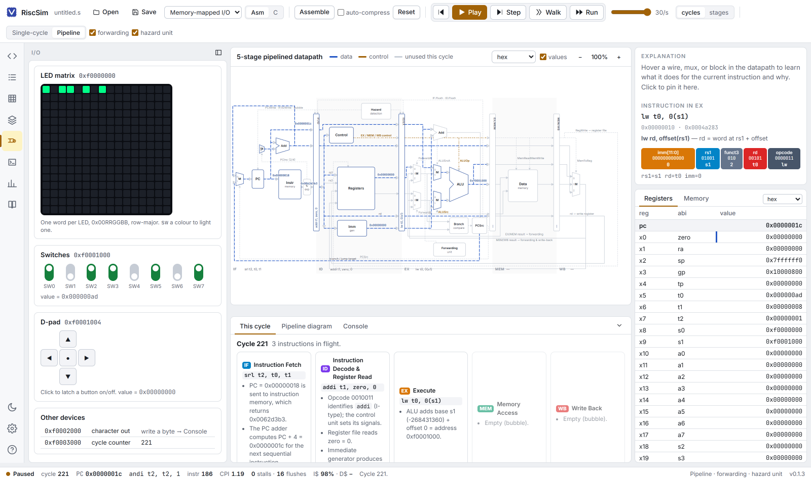
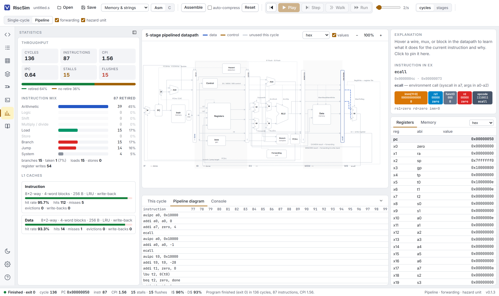
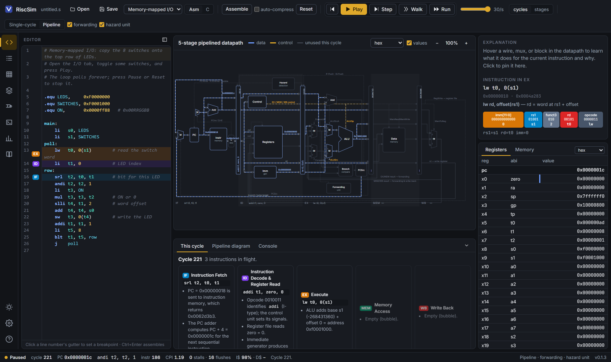

<h1 align="center">RiscSim</h1>

<p align="center">
  <strong>A desktop RISC-V assembly editor and processor simulator built for teaching computer architecture.</strong><br>
  Hover any wire and it tells you why that wire is lit for this instruction.
</p>

<p align="center">
  <a href="../../releases/latest"></a>
  
  
</p>



<p align="center"><em>Cycle 4 of <code>sub t3, t1, t0</code>. Live wires are drawn in colour, unused hardware fades out, and hovering the ALU says exactly what it computed and where the result is going.</em></p>

RiscSim is built from scratch around the question students actually ask when they look at a datapath diagram: *"why is that wire lit up for this instruction?"* Hover any wire, mux, register, cache line, or control signal and RiscSim tells you its current value and a plain-English reason it is (or isn't) active for the instruction flowing through it. Step a cycle at a time, walk through a single cycle one pipeline stage at a time, and rewind whenever you need to.

## Download

Runs as a native application on **Windows, macOS, and Linux**. Grab the installer for your platform from the [latest release](../../releases/latest):

| Platform | File |
| --- | --- |
| Windows | `RiscSim-<version>-win-x64.exe` (installer) or `.zip` (portable) |
| macOS | `RiscSim-<version>-mac-universal.dmg` (or `.zip`) |
| Linux | `RiscSim-<version>-linux-x86_64.AppImage` or `.deb` |

No project setup, no toolchain, no configuration: open it, pick an example from the Examples menu, and press Step.

The installers are not code-signed yet. Windows SmartScreen will say the publisher is unknown: choose *More info › Run anyway*. macOS may say the app is damaged or from an unidentified developer; open it once with right-click › Open, or run `xattr -cr /Applications/RiscSim.app`.

RiscSim checks GitHub Releases for a newer version shortly after launch and every few hours while running. On Windows and Linux (AppImage) the update downloads in the background and installs when you restart, or when you quit. On macOS and the Linux `.deb` it tells you a new version exists and opens the download page, because installing over an unsigned app is not permitted there. You can trigger a check any time from *Help › Check for updates…*.

To compile C you also need a RISC-V GCC. The xPack `riscv-none-elf-gcc` release works on all three platforms; Debian/Ubuntu users can `apt install gcc-riscv64-unknown-elf`. Point RiscSim at it under File › Settings (or leave it blank to auto-detect on `PATH`).

## The datapath, explained

Every block, wire, mux and control signal in both diagrams carries a contextual explanation. Not a generic description of what an ALU is — what *this* ALU did, this cycle, for *this* instruction.



Click instead of hovering and the explanation pins itself in the Inspector, next to a colour-coded bit-field breakdown of the instruction in flight.

### Five-stage pipeline with real hazard handling

Switch to the pipelined processor and the diagram grows a hazard-detection unit, a forwarding unit, and the four pipeline registers. Forwarding and hazard detection each have a checkbox, so you can turn them off live and watch the results go wrong.



### Walk mode: one stage at a time

*Walk* reveals a single cycle stage by stage, dimming the hardware that hasn't acted yet and animating the wires of the stage that just did — the missing intermediate step between "the clock ticked" and "here is everything that happened".



### Instruction/cycle diagram

Stalls show up as bubbles, flushed instructions as ×, and the whole grid scrolls back through the run.



### Configurable L1 caches

Sets, ways, block size, LRU/FIFO/random replacement, write-back/write-through and write-allocate — with every line visible, and a tag/index/offset breakdown of the last access.



### Memory-mapped I/O

A 16×16 RGB LED matrix, eight switches, a d-pad, a character output device, and a cycle counter, all at documented addresses. Flip a switch while the program runs and the LEDs follow.



### Whole-run statistics

CPI/IPC, stall and flush counts, pipeline utilisation, instruction mix by category, branch-taken rate, memory traffic, and per-cache hit rates.



### And a dark theme



## Features

- **Two processors.** Single-cycle RV32IMC, and a five-stage in-order pipeline (IF, ID, EX, MEM, WB) with EX/MEM and MEM/WB forwarding, a load-use hazard unit, branches resolved in EX with a two-instruction flush, and precise-trap handling for `ecall`. Forwarding and hazard detection can be switched off live to watch results go wrong.
- **Explain-on-hover datapath.** Every element of both diagrams has a contextual explanation ("ALUSrc=1 because `addi` carries an immediate", "ForwardA selects EX/MEM because the `add` one ahead is about to write t1 = 6").
- **Walk mode.** Reveal a cycle one stage at a time, dimming what hasn't happened yet and animating the wires of the stage that just did. Auto-play by cycles or by stages, from 0.5 to 30 steps per second.
- **This-cycle narration.** Five stage cards describe what IF/ID/EX/MEM/WB did, with hazard banners naming the instructions involved.
- **Reverse execution** of every cycle, including memory, device, and cache state.
- **Pipeline diagram** with stall bubbles and flushed instructions.
- **RV32C compressed instructions.** Explicit `c.*` mnemonics, an auto-compress option with branch relaxation, a decompressor block in IF, and the +2/+4 PC increment mux.
- **L1 instruction and data caches.** Sets, ways, block size, LRU/FIFO/random replacement, write-back/write-through, write-allocate; hit/miss statistics, evictions, write-backs, a live view of every line, and a tag/index/offset breakdown of the last access.
- **Memory-mapped I/O.** A 16×16 RGB LED matrix, eight switches, a d-pad, a character output device, and a cycle counter, all at documented addresses.
- **Console input** syscalls (`read_int`, `read_string`, `read_char`) that block the program until you type into the console.
- **C programs.** Switch the editor to C, press Compile, and RiscSim runs your installed RISC-V GCC with its own start-up file, linker script, and `riscsim.h`, then loads the ELF. File › Load ELF opens any rv32 ELF built elsewhere.
- **Editor** with RISC-V and C highlighting, breakpoints, per-stage line markers, assembler errors, file open/save, recent files, and dark mode.
- **Inspector** with a colour-coded bit-field breakdown of the instruction in flight; registers with read/write highlighting; memory dump with data labels and last-access highlighting.
- **Workbench layout.** An activity rail on the left opens a side panel for each part of the machine (editor, program listing, memory, caches, I/O devices, console, statistics, ISA reference; `Ctrl+1`…`Ctrl+8`, `Ctrl+B` to hide) while registers and memory stay on the right; a status bar shows run state, cycle, PC, next instruction, CPI, and cache hit rates at all times. Light and dark themes.
- **Statistics** for the whole run: CPI/IPC, stall and flush counts, pipeline utilisation, instruction mix by category, branch-taken rate, memory traffic, and per-cache hit rates.
- **Reference panel**: searchable RV32IM instruction table, register ABI roles and calling convention, syscalls, memory map, device addresses, directives, pseudo-instructions, and RV32C mnemonics.

## Using the simulator

1. **Write or pick a program.** The Examples menu covers arithmetic, loops, function calls, strings, data hazards, control hazards, compressed instructions, memory-mapped I/O, and console input. Ctrl+Enter assembles.
2. **Choose a processor** and, for the pipeline, whether forwarding and the hazard unit are enabled.
3. **Step / Walk / Play / Run.** *Step* executes one clock cycle. *Walk* advances one stage of the current cycle. *Play* auto-steps by cycles or stages. *Run* goes to the end or the next breakpoint (click a line's gutter). *⏮* rewinds.
4. **Hover anything in the datapath.** Click to pin the explanation in the Inspector.
5. **Explore the tabs.** *This cycle* narrates; *Pipeline diagram* charts instructions against cycles; *Cache* configures and visualises the L1 caches; *I/O* holds the LEDs, switches, and d-pad; *Console* shows program output and takes input.

### Keyboard

| Key | Action |
| --- | --- |
| `N` / F10 | Step one cycle |
| `M` / F11 | Walk one stage |
| `B` / F9 | Step back |
| Space / F5 | Play / pause |
| `R` | Reset |
| Ctrl+Enter | Assemble / compile |
| Ctrl+O, Ctrl+S | Open / save |
| `Ctrl+1`…`Ctrl+8` | Side panels (`Ctrl+B` hides them) |
| Ctrl+wheel, drag | Zoom / pan the datapath |
| Esc | Unpin, pause |

### Supported assembly

- RV32I base, M extension (`mul`, `mulh`, `mulhsu`, `mulhu`, `div`, `divu`, `rem`, `remu`), and C extension (`c.addi`, `c.li`, `c.lui`, `c.addi16sp`, `c.addi4spn`, `c.lw`, `c.sw`, `c.lwsp`, `c.swsp`, `c.j`, `c.jal`, `c.jr`, `c.jalr`, `c.beqz`, `c.bnez`, `c.mv`, `c.add`, `c.sub`, `c.xor`, `c.or`, `c.and`, `c.andi`, `c.slli`, `c.srli`, `c.srai`, `c.nop`, `c.ebreak`).
- Pseudo-instructions: `li`, `la`, `mv`, `nop`, `not`, `neg`, `seqz`, `snez`, `sltz`, `sgtz`, `j`, `jr`, `jal label`, `jalr rs`, `call`, `tail`, `ret`, `beqz`, `bnez`, `blez`, `bgez`, `bltz`, `bgtz`, `bgt`, `ble`, `bgtu`, `bleu`, and load/store with a bare symbol.
- Directives: `.text`, `.data`, `.section`, `.word`, `.half`, `.byte`, `.ascii`, `.asciz`/`.string`, `.space`/`.zero`, `.align`, `.balign`, `.equ`/`.set`, `.globl` (ignored).
- Expressions in immediates (`N*2+1`, `%hi(sym)`, `%lo(sym)`, `%pcrel_hi`, `%pcrel_lo`), character literals, and `#` or `//` comments.

### Memory map

| Range | Contents |
| --- | --- |
| `0x00000000` | `.text` |
| `0x10000000` | `.data` / `.bss` (`gp` = `0x10000800`) |
| `0x7ffffff0` | initial `sp` |
| `0xF0000000` | LED matrix, 256 words of `0x00RRGGBB` |
| `0xF0001000` | switches (bit i = switch i) |
| `0xF0001004` | d-pad (up=1, down=2, left=4, right=8, centre=16) |
| `0xF0002000` | character output |
| `0xF0003000` | cycle counter |

### Syscalls (`a7`, then `ecall`)

1 print_int · 4 print_string · 5 read_int · 8 read_string (a0 buffer, a1 length) · 10 exit · 11 print_char · 12 read_char · 17 exit2 · 34 print_hex · 35 print_bin · 36 print_unsigned.

## Building from source

```bash
npm install
npm run dev        # Vite dev server + Electron window with live reload
npm test           # assembler, simulator, cache, ELF, I/O, and explanation-coverage tests
npm run dist       # installers in release/ for the current platform
```

On Windows, if `npm run dist` fails with `EPERM … rename win-unpacked.tmp`, the Documents folder is being locked by sync or antivirus scanning; build to another location with `npx electron-builder -c.directories.output=C:/riscsim-release`.

The screenshots above are captured from the running app, not mocked up: start `npm run dev:web`, then `node scripts/readme-shots.mjs docs/media`.

### Releasing

1. Bump `version` in `package.json` and commit.
2. Tag it `vX.Y.Z` (the tag must match the version exactly) and push the tag.

GitHub Actions runs the tests, builds installers for Windows, macOS, and Linux, and attaches them plus the auto-update metadata (`latest*.yml`, `*.blockmap`) to a release. Installed copies pick up the new version on their next check.

## Architecture

```
electron/                 main process (menus, file dialogs, settings, GCC invocation) and preload bridge
resources/                crt0.S, riscsim.ld, riscsim.h used when compiling C
src/core/                 pure TypeScript, no DOM, unit-tested
  isa/                    instruction table, decoder, encoder, RV32C expand/compress
  asm/                    lexer, expression evaluator, pseudo-instructions, relaxing two-pass assembler
  elf/                    ELF32 parser and loader
  cache/                  set-associative cache model
  io/                     memory-mapped devices
  sim/                    single-cycle and pipeline processors, machine with undo history, explanations, narration
src/ui/                   React renderer: datapath SVG layouts and renderer, CodeMirror editor, panels, zustand store
tests/                    vitest suites
```

Every cycle the simulator produces a `CycleTrace`: for each stage, everything the datapath computed for the instruction in it (operands, forwarding sources, ALU inputs and outputs, memory address and data, write-back value, next PC) plus hazard information. The datapath renderer, the explanation rules, the narrator, the caches, and the pipeline diagram are all pure functions of that trace, which is what makes the hover explanations exact rather than generic.

## License

MIT.
